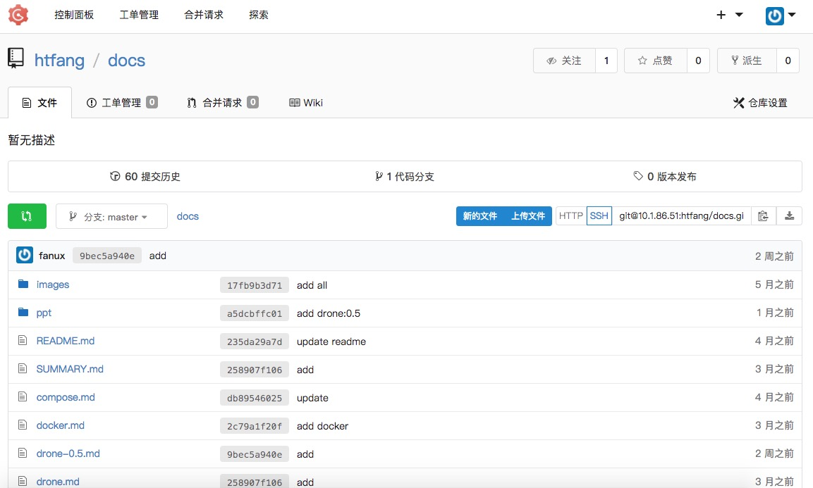
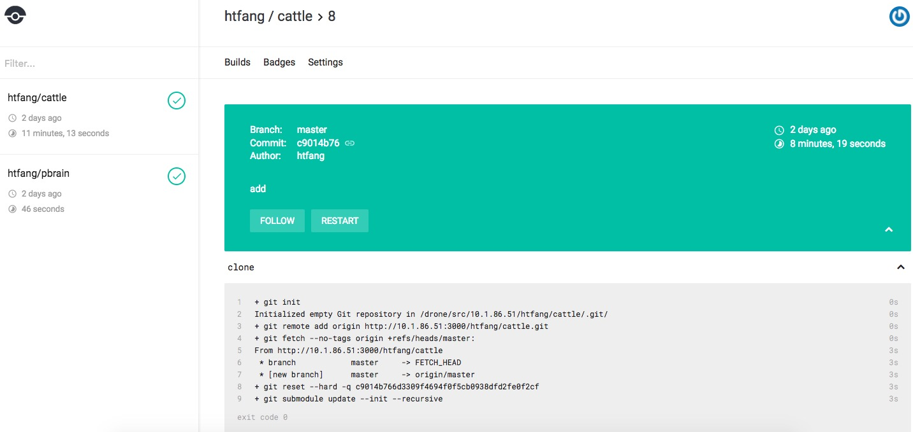
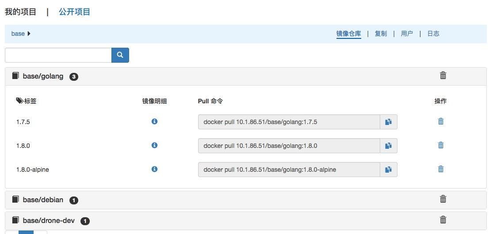
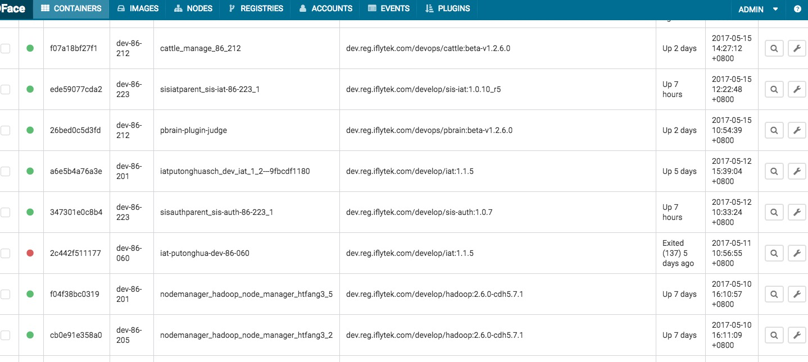
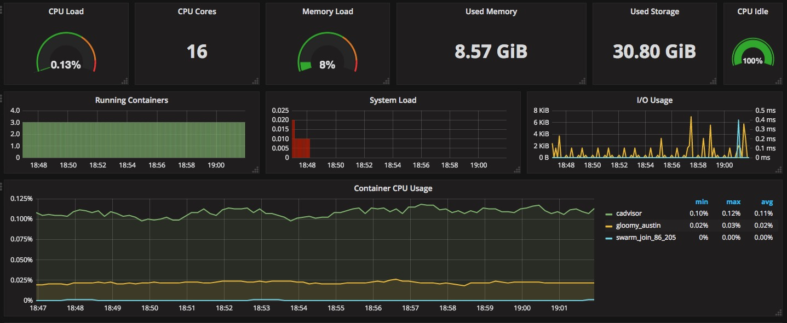

## git仓库 - 如同拥有了私有的github 支持web UI

此组件比较简单

企业自研成本 ： 预计调研+使用构建+配置填坑 7人天
sealyun服务成本 ：1分钟
难度系数： :star:

## 自动构建 - 监听仓库的push事件，自动将代码构建成docker镜像并提交到镜像仓库

这是个非常优秀的组件，思维先进，笔者认为有取代jekins的资格。但是比较新的东西，我从这个组件不太稳定时开始用的，一直到他稳定，填坑无数。

企业自研成本 ： 30人天
sealyun服务成本 ：1小时
难度系数： :star: :star: :star: :star:

## 镜像仓库 - 管理所有的docker镜像，支持web UI

私有镜像仓库不难，不过也有坑的地方，如访问不了，https配置仓库迁移等

企业自研成本 ： 3 人天
sealyun服务成本 ：半小时
难度系数： :star: :star: 

## 容器UI - 容器webUI，在界面上管理容器，镜像和节点等

企业自研成本 ： 3 人天
sealyun服务成本 ：半小时
难度系数： :star: 

## 高大上的监控，告警系统 

监控系统子组件约五个，非常复杂，不熟悉监控系统的人员可能要花很长时间才能做的好。

企业自研成本 ： 30人天
sealyun服务成本 ：1小时
难度系数： :star: :star: :star: :star: :star:
